# 开源组件包安全检测系统概要设计说明书

|     |     |     |     |
| --- | --- | --- | --- |
| 拟制  | 系统设计团队 | 日期  | 2024年12月 |
| 评审人 | 技术评审委员会 | 日期  | 2024年12月 |
| 批准  | 项目负责人 | 日期  | 2024年12月 |

**武汉学链科技有限公司**

版权所有 不得复制

## Revision Record 修订记录

| Date<br><br>日期 | Revision Version<br><br>修订版本 | CR ID /Defect ID<br><br>CR/ Defect号 | Sec No.<br><br>修改章节 | Change Description<br><br>修改描述 | Author<br><br>作者 |
| --- | --- | --- | --- | --- | --- |
| 2024-12-01 | 1.0 | - | 全部 | 初始版本创建 | 系统设计团队 |

## Keywords 关键词：

开源组件、安全检测、机器学习、AI分析、恶意代码识别、软件供应链安全

## Abstract 摘 要：

本文档描述了开源组件包安全检测系统的概要设计，该系统采用机器学习与AI技术相结合的方式，对上传的开源组件包进行安全风险检测。系统支持多种包格式，提供详细的风险分析报告，并具备社区功能和管理功能。系统采用Flask框架构建，使用SQLite数据库存储，通过XGBoost模型和DeepSeek AI进行双重分析，确保检测的准确性和可靠性。

## List of abbreviations 缩略语清单：

|     |     |     |
| --- | --- | --- |
| Abbreviations缩略语 | Full spelling 英文全名 | Chinese explanation 中文解释 |
| AI | Artificial Intelligence | 人工智能 |
| API | Application Programming Interface | 应用程序编程接口 |
| CSV | Comma-Separated Values | 逗号分隔值 |
| DB | Database | 数据库 |
| HTTP | HyperText Transfer Protocol | 超文本传输协议 |
| JSON | JavaScript Object Notation | JavaScript对象表示法 |
| LLM | Large Language Model | 大语言模型 |
| ML | Machine Learning | 机器学习 |
| PyPI | Python Package Index | Python包索引 |
| REST | Representational State Transfer | 表述性状态转移 |
| SQL | Structured Query Language | 结构化查询语言 |
| XGBoost | eXtreme Gradient Boosting | 极端梯度提升 |

# 1 简介

## 1.1 目的

本文档的目的是为开源组件包安全检测系统提供详细的概要设计说明，包括系统架构、模块设计、数据库设计、界面设计等。本文档主要面向系统开发人员、测试人员、项目经理以及相关技术评审人员，为系统的开发、测试和维护提供技术指导。

## 1.2 范围

### 1.2.1 软件名称

开源组件包安全检测系统（Open Source Package Security Scanner）

### 1.2.2 软件功能

本系统主要完成以下功能：

**核心功能：**
- 开源组件包安全风险检测
- 多种包格式支持（PyPI、npm、jar等）
- 机器学习模型分析
- AI深度分析
- 详细检测报告生成

**辅助功能：**
- 用户认证与权限管理
- 扫描历史记录管理
- 社区异常报告功能
- 包百科知识库
- 系统管理功能

**不包含功能：**
- 实时网络监控
- 自动修复功能
- 第三方安全工具集成

### 1.2.3 软件应用

本系统主要应用于以下领域：

- **软件开发企业**：在开发过程中检测第三方依赖包的安全性
- **安全研究机构**：进行开源组件安全分析和研究
- **DevOps团队**：在CI/CD流程中集成安全检测
- **个人开发者**：检测项目依赖的安全性

## 1.3 参考资料

1. 《软件包投毒检测系统需求规格说明书》
2. 《软件包投毒检测项目立项报告》
3. Flask官方文档：https://flask.palletsprojects.com/
4. XGBoost官方文档：https://xgboost.readthedocs.io/
5. DeepSeek API文档：https://platform.deepseek.com/

# 2 概要设计

## 2.1 第0层设计描述

### 2.1.1 软件系统上下文定义

系统与外部实体的交互关系如下：

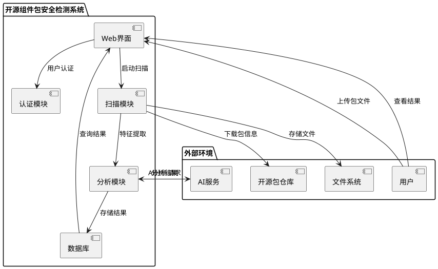

### 2.1.2 设计思路

#### （1）架构设计思路

系统采用分层架构设计，主要分为以下几层：

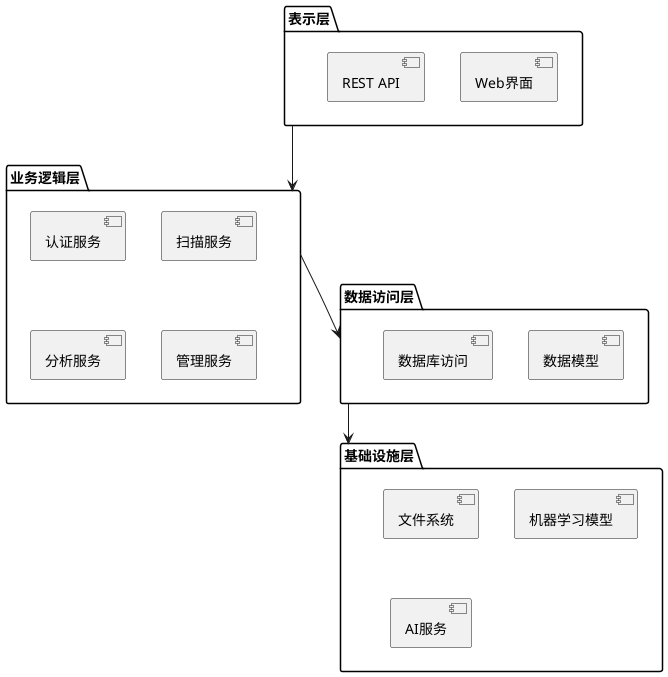

#### （2）程序框架、目录结构

```
Detect-main/
├── app/                    # 主应用目录
│   ├── __init__.py        # Flask应用工厂
│   ├── models/            # 数据模型
│   ├── routes/            # 路由控制器
│   ├── services/          # 业务逻辑服务
│   ├── templates/         # HTML模板
│   ├── static/            # 静态资源
│   └── utils/             # 工具函数
├── config/                # 配置文件目录
├── models/                # 机器学习模型
├── data/                  # 数据文件目录
├── tests/                 # 测试文件目录
├── scripts/               # 脚本文件目录
├── docs/                  # 文档目录
└── requirements.txt       # Python依赖
```

## 2.2 第1层设计描述

### 2.2.1 系统结构

#### 2.2.1.1 系统结构描述

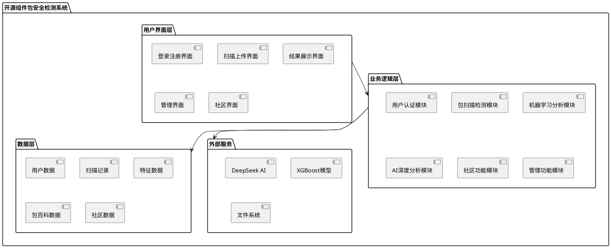

#### 2.2.1.2 业务流程说明

**主要业务流程：**

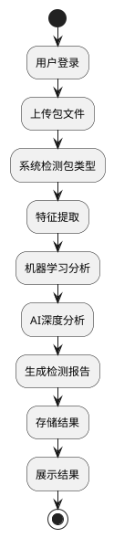

### 2.2.2 分解描述

#### 2.2.2.1 用户认证模块

**1、简介**

用户认证模块负责系统的用户管理、登录认证、权限控制等功能，确保系统安全性和用户数据的隔离。

**2、功能列表**

- 用户注册
- 用户登录
- 密码加密
- 会话管理
- 权限验证

##### 2.2.2.1.1 用户注册功能

**1 功能设计描述**

**（1）类**

**1）User类**

负责用户数据的封装和基本操作。

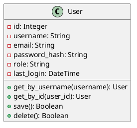

**2）AuthService类**

负责用户认证相关的业务逻辑。

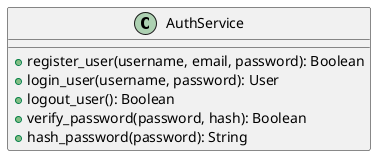

**（2）类与类之间关系**

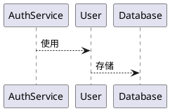

**（3）文件列表**

|     |     |     |     |
| --- | --- | --- | --- |
| 名称  | 类型  | 存放位置 | 说明  |
| auth.py | Python | app/routes/auth.py | 认证路由控制器 |
| db_models.py | Python | app/models/db_models.py | 用户数据模型 |
| login.html | HTML | app/templates/login.html | 登录页面 |
| register.html | HTML | app/templates/register.html | 注册页面 |

**2 功能实现说明**

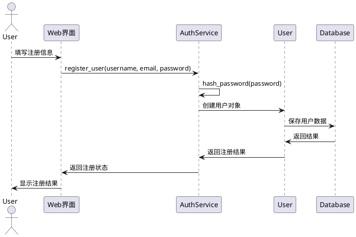

#### 2.2.2.2 包扫描检测模块

**1、简介**

包扫描检测模块是系统的核心功能模块，负责接收用户上传的包文件，进行特征提取、安全分析，并生成检测报告。

**2、功能列表**

- 文件上传处理
- 包类型检测
- 特征提取
- 扫描状态管理
- 结果存储

##### 2.2.2.2.1 文件上传功能

**1 功能设计描述**

**（1）类**

**1）ScanRecord类**

负责扫描记录的数据封装。

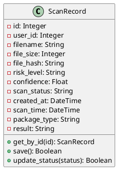

**2）ScanService类**

负责扫描相关的业务逻辑。

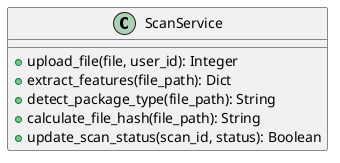

**（2）类与类之间关系**

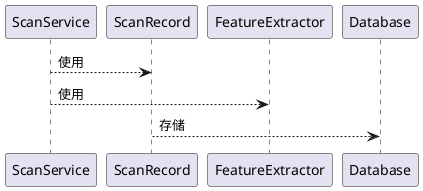

**（3）文件列表**

|     |     |     |     |
| --- | --- | --- | --- |
| 名称  | 类型  | 存放位置 | 说明  |
| scan.py | Python | app/routes/scan.py | 扫描路由控制器 |
| extractor.py | Python | app/services/extractor.py | 特征提取服务 |
| scan.html | HTML | app/templates/scan.html | 扫描上传页面 |
| progress.html | HTML | app/templates/progress.html | 扫描进度页面 |

**2 功能实现说明**

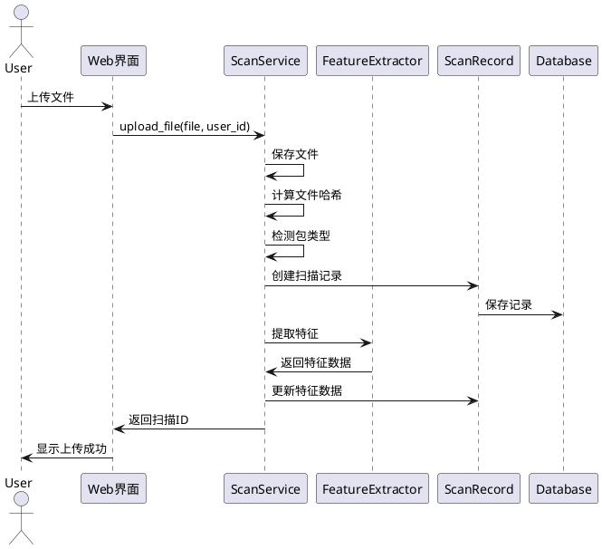

#### 2.2.2.3 机器学习分析模块

**1、简介**

机器学习分析模块使用XGBoost等机器学习算法对提取的特征进行分析，识别潜在的恶意行为。

**2、功能列表**

- 模型加载
- 特征预处理
- 风险预测
- 置信度计算
- 特征重要性分析

##### 2.2.2.3.1 风险预测功能

**1 功能设计描述**

**（1）类**

**1）SecurityClassifier类**

负责机器学习模型的加载和预测。

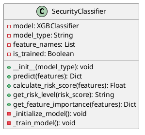

**2）FeatureProcessor类**

负责特征数据的预处理。

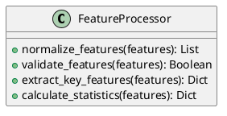

**（2）类与类之间关系**

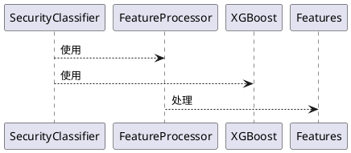

**（3）文件列表**

|     |     |     |     |
| --- | --- | --- | --- |
| 名称  | 类型  | 存放位置 | 说明  |
| classifier.py | Python | app/services/classifier.py | 机器学习分类器 |
| xgboost_model.pkl | Model | models/xgboost_model.pkl | XGBoost模型文件 |
| feature_names.txt | Text | data/feature_names.txt | 特征名称列表 |

**2 功能实现说明**

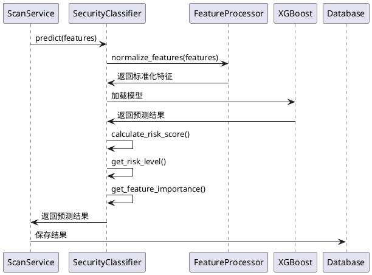

#### 2.2.2.4 AI深度分析模块

**1、简介**

AI深度分析模块使用DeepSeek等大语言模型对包进行深度分析，提供更详细的安全风险评估和解释。

**2、功能列表**

- AI模型调用
- 分析提示构建
- 结果解析
- 风险解释
- 建议生成

##### 2.2.2.4.1 AI分析功能

**1 功能设计描述**

**（1）类**

**1）DeepSeekAnalyzer类**

负责AI深度分析的核心功能。

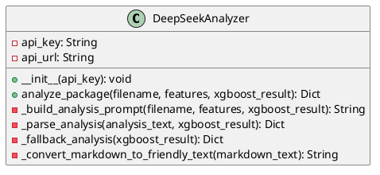

**2）AnalysisResult类**

负责分析结果的数据封装。

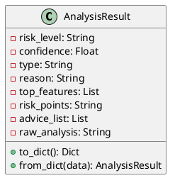

**（2）类与类之间关系**

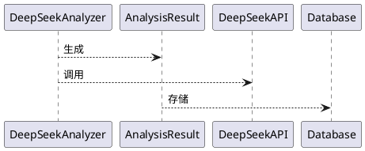

**（3）文件列表**

|     |     |     |     |
| --- | --- | --- | --- |
| 名称  | 类型  | 存放位置 | 说明  |
| analyzer.py | Python | app/services/analyzer.py | AI分析服务 |
| config.py | Python | config/config.py | API配置 |
| analysis_prompts.py | Python | app/utils/analysis_prompts.py | 分析提示模板 |

**2 功能实现说明**

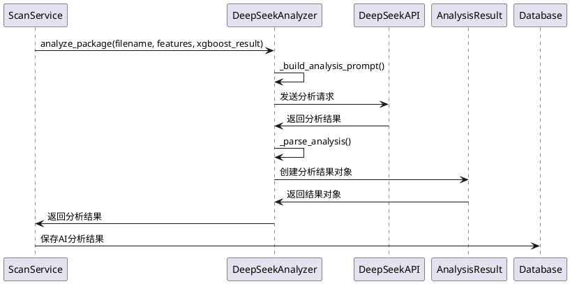

#### 2.2.2.5 社区功能模块

**1、简介**

社区功能模块提供用户交流、异常报告、知识分享等功能，增强系统的社区属性。

**2、功能列表**

- 异常报告
- 社区讨论
- 知识分享
- 用户互动

##### 2.2.2.5.1 异常报告功能

**1 功能设计描述**

**（1）类**

**1）AnomalyReport类**

负责异常报告的数据管理。

```plantuml
@startuml
class AnomalyReport {
    -id: Integer
    -user_id: Integer
    -scan_record_id: Integer
    -title: String
    -description: String
    -reason: String
    -status: String
    -created_at: DateTime
    +save(): Boolean
    +get_latest(limit): List
    +get_all(): List
}
@enduml
```

**2）CommunityService类**

负责社区功能的业务逻辑。

```plantuml
@startuml
class CommunityService {
    +create_report(user_id, scan_id, title, description, reason): Boolean
    +get_reports(limit): List
    +update_report_status(report_id, status): Boolean
    +search_reports(query): List
}
@enduml
```

**（2）类与类之间关系**

```plantuml
@startuml
CommunityService --> AnomalyReport : 使用
CommunityService --> User : 关联
AnomalyReport --> ScanRecord : 关联
@enduml
```

**（3）文件列表**

|     |     |     |     |
| --- | --- | --- | --- |
| 名称  | 类型  | 存放位置 | 说明  |
| community.py | Python | app/routes/community.py | 社区路由控制器 |
| community_models.py | Python | app/models/community_models.py | 社区数据模型 |
| community.html | HTML | app/templates/community/index.html | 社区主页 |
| report_anomaly.html | HTML | app/templates/community/report_anomaly.html | 异常报告页面 |

#### 2.2.2.6 管理功能模块

**1、简介**

管理功能模块为管理员提供系统管理、用户管理、数据统计等功能。

**2、功能列表**

- 用户管理
- 系统配置
- 数据统计
- 模型管理

##### 2.2.2.6.1 用户管理功能

**1 功能设计描述**

**（1）类**

**1）AdminService类**

负责管理员功能的业务逻辑。

```plantuml
@startuml
class AdminService {
    +get_all_users(): List
    +update_user_role(user_id, role): Boolean
    +delete_user(user_id): Boolean
    +get_system_stats(): Dict
    +get_scan_statistics(): Dict
}
@enduml
```

**2）UserManagement类**

负责用户管理的具体操作。

```plantuml
@startuml
class UserManagement {
    +list_users(): List
    +edit_user(user_id, data): Boolean
    +delete_user(user_id): Boolean
    +reset_user_password(user_id): Boolean
}
@enduml
```

**（2）类与类之间关系**

```plantuml
@startuml
AdminService --> UserManagement : 使用
AdminService --> User : 管理
UserManagement --> Database : 操作
@enduml
```

**（3）文件列表**

|     |     |     |     |
| --- | --- | --- | --- |
| 名称  | 类型  | 存放位置 | 说明  |
| admin.py | Python | app/routes/admin.py | 管理路由控制器 |
| admin.html | HTML | app/templates/admin.html | 管理主页 |
| user_management.html | HTML | app/templates/user_management.html | 用户管理页面 |

### 2.2.3 接口描述

#### 2.2.3.1 文件上传接口

**Name名称：** upload_file

**Description说明：** 处理用户上传的包文件，启动扫描流程

**Definition定义：**
```python
POST /upload
Content-Type: multipart/form-data

Parameters:
- file: File (required) - 上传的包文件
- user_id: Integer (required) - 用户ID

Response:
{
    "success": Boolean,
    "scan_id": Integer,
    "message": String
}
```

#### 2.2.3.2 扫描状态查询接口

**Name名称：** get_scan_status

**Description说明：** 查询扫描任务的当前状态和进度

**Definition定义：**
```python
GET /scan_status/<scan_id>

Parameters:
- scan_id: Integer (required) - 扫描ID

Response:
{
    "status": String,  // pending, processing, completed, failed
    "progress": Integer,  // 0-100
    "current_task": String
}
```

#### 2.2.3.3 结果获取接口

**Name名称：** get_scan_results

**Description说明：** 获取扫描的详细结果和分析报告

**Definition定义：**
```python
GET /results/<scan_id>

Parameters:
- scan_id: Integer (required) - 扫描ID

Response:
{
    "id": Integer,
    "filename": String,
    "risk_level": String,
    "confidence": Float,
    "xgboost_result": Object,
    "llm_result": Object,
    "features": Object,
    "malicious_code_snippet": String,
    "code_location": String,
    "malicious_action": String,
    "technical_details": String
}
```

# 3 数据结构/数据库设计

## 3.1 概念模型

```plantuml
@startuml
entity "用户" as User {
    * id : Integer
    --
    * username : String
    * email : String
    * password_hash : String
    * role : String
    last_login : DateTime
}

entity "扫描记录" as ScanRecord {
    * id : Integer
    --
    * user_id : Integer
    * filename : String
    file_size : Integer
    file_hash : String
    risk_level : String
    confidence : Float
    * scan_status : String
    * created_at : DateTime
    scan_time : DateTime
    package_type : String
    result : String
    error_message : String
    xgboost_result : String
    llm_result : String
    risk_explanation : String
    malicious_code_snippet : String
    code_location : String
    malicious_action : String
    technical_details : String
}

entity "特征数据" as FeatureData {
    * id : Integer
    --
    * scan_id : Integer
    feature_data : String
    * created_at : DateTime
}

entity "包百科" as PackageEncyclopedia {
    * id : Integer
    --
    * package_name : String
    package_type : String
    description : String
    version : String
    author : String
    license : String
    repository : String
    official_website : String
    security_notes : String
    common_risks : String
    best_practices : String
    alternatives : String
    tags : String
    * created_at : DateTime
    updated_at : DateTime
}

entity "异常报告" as AnomalyReport {
    * id : Integer
    --
    user_id : Integer
    scan_record_id : Integer
    * title : String
    * description : String
    reason : String
    * status : String
    * created_at : DateTime
}

User ||--o{ ScanRecord : 创建
ScanRecord ||--o| FeatureData : 包含
User ||--o{ AnomalyReport : 提交
ScanRecord ||--o{ AnomalyReport : 关联
@enduml
```

## 3.2 数据库表设计

### 3.2.1 用户表（users）

| 字段名 | 数据类型 | 长度 | 是否为空 | 默认值 | 说明 |
|--------|----------|------|----------|--------|------|
| id | INTEGER | - | NOT NULL | AUTOINCREMENT | 主键 |
| username | TEXT | - | NOT NULL | - | 用户名，唯一 |
| email | TEXT | - | - | - | 邮箱，唯一 |
| password_hash | TEXT | - | NOT NULL | - | 密码哈希 |
| role | TEXT | - | NOT NULL | 'user' | 用户角色 |
| last_login | TIMESTAMP | - | - | - | 最后登录时间 |

**索引设计：**
- PRIMARY KEY (id)
- UNIQUE INDEX (username)
- UNIQUE INDEX (email)
- INDEX (role)

### 3.2.2 扫描记录表（scan_records）

| 字段名 | 数据类型 | 长度 | 是否为空 | 默认值 | 说明 |
|--------|----------|------|----------|--------|------|
| id | INTEGER | - | NOT NULL | AUTOINCREMENT | 主键 |
| user_id | INTEGER | - | NOT NULL | - | 用户ID，外键 |
| filename | TEXT | - | NOT NULL | - | 文件名 |
| file_size | INTEGER | - | - | - | 文件大小 |
| file_hash | TEXT | - | - | - | 文件哈希 |
| risk_level | TEXT | - | - | - | 风险等级 |
| confidence | REAL | - | - | - | 置信度 |
| scan_status | TEXT | - | NOT NULL | - | 扫描状态 |
| created_at | TIMESTAMP | - | NOT NULL | CURRENT_TIMESTAMP | 创建时间 |
| scan_time | TIMESTAMP | - | - | - | 扫描时间 |
| package_type | TEXT | - | - | - | 包类型 |
| result | TEXT | - | - | - | 扫描结果 |
| error_message | TEXT | - | - | - | 错误信息 |
| xgboost_result | TEXT | - | - | - | XGBoost结果 |
| llm_result | TEXT | - | - | - | AI分析结果 |
| risk_explanation | TEXT | - | - | - | 风险解释 |
| malicious_code_snippet | TEXT | - | - | - | 恶意代码片段 |
| code_location | TEXT | - | - | - | 代码位置 |
| malicious_action | TEXT | - | - | - | 恶意行为 |
| technical_details | TEXT | - | - | - | 技术细节 |

**索引设计：**
- PRIMARY KEY (id)
- FOREIGN KEY (user_id) REFERENCES users(id)
- INDEX (user_id)
- INDEX (scan_status)
- INDEX (risk_level)
- INDEX (created_at)
- INDEX (file_hash)

### 3.2.3 特征数据表（features）

| 字段名 | 数据类型 | 长度 | 是否为空 | 默认值 | 说明 |
|--------|----------|------|----------|--------|------|
| id | INTEGER | - | NOT NULL | AUTOINCREMENT | 主键 |
| scan_id | INTEGER | - | NOT NULL | - | 扫描ID，外键 |
| feature_data | TEXT | - | - | - | 特征数据JSON |
| created_at | TIMESTAMP | - | NOT NULL | CURRENT_TIMESTAMP | 创建时间 |

**索引设计：**
- PRIMARY KEY (id)
- FOREIGN KEY (scan_id) REFERENCES scan_records(id)
- INDEX (scan_id)

### 3.2.4 包百科表（package_encyclopedia）

| 字段名 | 数据类型 | 长度 | 是否为空 | 默认值 | 说明 |
|--------|----------|------|----------|--------|------|
| id | INTEGER | - | NOT NULL | AUTOINCREMENT | 主键 |
| package_name | TEXT | - | NOT NULL | - | 包名 |
| package_type | TEXT | - | - | - | 包类型 |
| description | TEXT | - | - | - | 描述 |
| version | TEXT | - | - | - | 版本 |
| author | TEXT | - | - | - | 作者 |
| license | TEXT | - | - | - | 许可证 |
| repository | TEXT | - | - | - | 仓库地址 |
| official_website | TEXT | - | - | - | 官方网站 |
| security_notes | TEXT | - | - | - | 安全说明 |
| common_risks | TEXT | - | - | - | 常见风险 |
| best_practices | TEXT | - | - | - | 最佳实践 |
| alternatives | TEXT | - | - | - | 替代方案 |
| tags | TEXT | - | - | - | 标签 |
| created_at | TIMESTAMP | - | NOT NULL | CURRENT_TIMESTAMP | 创建时间 |
| updated_at | TIMESTAMP | - | - | - | 更新时间 |

**索引设计：**
- PRIMARY KEY (id)
- UNIQUE INDEX (package_name, package_type)
- INDEX (package_type)
- INDEX (tags)
- INDEX (created_at)

### 3.2.5 异常报告表（anomaly_reports）

| 字段名 | 数据类型 | 长度 | 是否为空 | 默认值 | 说明 |
|--------|----------|------|----------|--------|------|
| id | INTEGER | - | NOT NULL | AUTOINCREMENT | 主键 |
| user_id | INTEGER | - | - | - | 用户ID，外键 |
| scan_record_id | INTEGER | - | - | - | 扫描记录ID，外键 |
| title | TEXT | - | NOT NULL | - | 报告标题 |
| description | TEXT | - | NOT NULL | - | 报告描述 |
| reason | TEXT | - | - | - | 报告原因 |
| status | TEXT | - | NOT NULL | 'pending' | 状态 |
| created_at | TIMESTAMP | - | NOT NULL | CURRENT_TIMESTAMP | 创建时间 |

**索引设计：**
- PRIMARY KEY (id)
- FOREIGN KEY (user_id) REFERENCES users(id)
- FOREIGN KEY (scan_record_id) REFERENCES scan_records(id)
- INDEX (user_id)
- INDEX (scan_record_id)
- INDEX (status)
- INDEX (created_at)

## 3.3 数据库关系图

```plantuml
@startuml
!define TABLE(name,desc) class name as "desc" << (T,#FFAAAA) >>
!define PK(x) <b>x</b>
!define FK(x) <i>x</i>

TABLE(users, "用户表") {
    PK(id) : INTEGER
    --
    username : TEXT
    email : TEXT
    password_hash : TEXT
    role : TEXT
    last_login : TIMESTAMP
}

TABLE(scan_records, "扫描记录表") {
    PK(id) : INTEGER
    --
    FK(user_id) : INTEGER
    filename : TEXT
    file_size : INTEGER
    file_hash : TEXT
    risk_level : TEXT
    confidence : REAL
    scan_status : TEXT
    created_at : TIMESTAMP
    scan_time : TIMESTAMP
    package_type : TEXT
    result : TEXT
    error_message : TEXT
    xgboost_result : TEXT
    llm_result : TEXT
    risk_explanation : TEXT
    malicious_code_snippet : TEXT
    code_location : TEXT
    malicious_action : TEXT
    technical_details : TEXT
}

TABLE(features, "特征数据表") {
    PK(id) : INTEGER
    --
    FK(scan_id) : INTEGER
    feature_data : TEXT
    created_at : TIMESTAMP
}

TABLE(package_encyclopedia, "包百科表") {
    PK(id) : INTEGER
    --
    package_name : TEXT
    package_type : TEXT
    description : TEXT
    version : TEXT
    author : TEXT
    license : TEXT
    repository : TEXT
    official_website : TEXT
    security_notes : TEXT
    common_risks : TEXT
    best_practices : TEXT
    alternatives : TEXT
    tags : TEXT
    created_at : TIMESTAMP
    updated_at : TIMESTAMP
}

TABLE(anomaly_reports, "异常报告表") {
    PK(id) : INTEGER
    --
    FK(user_id) : INTEGER
    FK(scan_record_id) : INTEGER
    title : TEXT
    description : TEXT
    reason : TEXT
    status : TEXT
    created_at : TIMESTAMP
}

users ||--o{ scan_records : "1:N"
scan_records ||--o| features : "1:1"
users ||--o{ anomaly_reports : "1:N"
scan_records ||--o{ anomaly_reports : "1:N"
@enduml
```

# 4 界面设计

## 4.1 主界面设计

**1 界面原图**

主界面采用现代化的深色主题设计，包含导航栏、功能区域和状态显示区域。

**2 界面说明**

- **导航栏**：包含系统Logo、主要功能菜单和用户信息
- **功能区域**：提供扫描上传、历史记录、社区功能等入口
- **状态显示**：显示系统状态和用户登录信息
- **响应式设计**：支持不同屏幕尺寸的适配

### 4.1.1 主界面布局

```plantuml
@startuml
!define RECTANGLE class

package "主界面布局" {
    [导航栏] as Navbar
    [侧边栏] as Sidebar
    [主内容区] as MainContent
    [状态栏] as StatusBar
}

package "导航栏组件" {
    [Logo] as Logo
    [主菜单] as MainMenu
    [用户信息] as UserInfo
    [通知] as Notifications
}

package "侧边栏组件" {
    [功能菜单] as FunctionMenu
    [快捷操作] as QuickActions
    [系统状态] as SystemStatus
}

package "主内容区组件" {
    [欢迎信息] as Welcome
    [统计卡片] as StatsCards
    [最近活动] as RecentActivity
    [快速扫描] as QuickScan
}

Navbar --> Logo
Navbar --> MainMenu
Navbar --> UserInfo
Navbar --> Notifications

Sidebar --> FunctionMenu
Sidebar --> QuickActions
Sidebar --> SystemStatus

MainContent --> Welcome
MainContent --> StatsCards
MainContent --> RecentActivity
MainContent --> QuickScan
@enduml
```

## 4.2 扫描结果界面

**1 界面原图**

扫描结果界面展示详细的检测报告，包括风险等级、置信度、特征分析等信息。

**2 界面说明**

- **风险概览**：显示整体风险等级和置信度
- **详细分析**：展示XGBoost和AI分析结果
- **特征分析**：显示关键特征和重要性
- **安全建议**：提供针对性的安全建议
- **恶意代码**：展示检测到的可疑代码片段

### 4.2.1 结果界面布局

```plantuml
@startuml
!define RECTANGLE class

package "扫描结果界面" {
    [文件信息] as FileInfo
    [风险概览] as RiskOverview
    [详细分析] as DetailedAnalysis
    [特征分析] as FeatureAnalysis
    [安全建议] as SecurityAdvice
    [恶意代码] as MaliciousCode
}

package "风险概览组件" {
    [风险等级] as RiskLevel
    [置信度] as Confidence
    [检测时间] as ScanTime
    [包类型] as PackageType
}

package "详细分析组件" {
    [XGBoost结果] as XGBoostResult
    [AI分析结果] as AIResult
    [综合分析] as CombinedAnalysis
}

package "特征分析组件" {
    [特征重要性] as FeatureImportance
    [关键特征] as KeyFeatures
    [特征统计] as FeatureStats
}

package "安全建议组件" {
    [风险点] as RiskPoints
    [建议措施] as Recommendations
    [最佳实践] as BestPractices
}

package "恶意代码组件" {
    [代码位置] as CodeLocation
    [代码片段] as CodeSnippet
    [恶意行为] as MaliciousAction
    [技术细节] as TechnicalDetails
}

FileInfo --> RiskOverview
RiskOverview --> DetailedAnalysis
DetailedAnalysis --> FeatureAnalysis
FeatureAnalysis --> SecurityAdvice
SecurityAdvice --> MaliciousCode

RiskOverview --> RiskLevel
RiskOverview --> Confidence
RiskOverview --> ScanTime
RiskOverview --> PackageType

DetailedAnalysis --> XGBoostResult
DetailedAnalysis --> AIResult
DetailedAnalysis --> CombinedAnalysis

FeatureAnalysis --> FeatureImportance
FeatureAnalysis --> KeyFeatures
FeatureAnalysis --> FeatureStats

SecurityAdvice --> RiskPoints
SecurityAdvice --> Recommendations
SecurityAdvice --> BestPractices

MaliciousCode --> CodeLocation
MaliciousCode --> CodeSnippet
MaliciousCode --> MaliciousAction
MaliciousCode --> TechnicalDetails
@enduml
```

## 4.3 用户界面设计原则

### 4.3.1 设计原则

1. **简洁性**：界面简洁明了，避免冗余信息
2. **一致性**：保持界面风格和交互方式的一致性
3. **可用性**：确保用户能够轻松完成操作
4. **响应性**：支持不同设备和屏幕尺寸
5. **可访问性**：考虑不同用户的需求和能力

### 4.3.2 色彩方案

- **主色调**：深蓝色系（#1e3a8a, #3b82f6）
- **辅助色**：橙色（#f97316）
- **背景色**：深色主题（#0f172a, #1e293b）
- **文字色**：浅色（#f8fafc, #cbd5e1）
- **状态色**：成功（#10b981）、警告（#f59e0b）、危险（#ef4444）

### 4.3.3 交互设计

- **导航**：清晰的导航结构，支持面包屑导航
- **反馈**：及时的操作反馈和状态提示
- **加载**：优雅的加载动画和进度指示
- **错误处理**：友好的错误提示和恢复建议

## 4.4 响应式设计

### 4.4.1 断点设计

- **移动端**：< 768px
- **平板端**：768px - 1024px
- **桌面端**：> 1024px

### 4.4.2 适配策略

- **弹性布局**：使用Flexbox和Grid布局
- **媒体查询**：针对不同屏幕尺寸优化
- **图片优化**：响应式图片和图标
- **触摸优化**：移动端触摸友好的交互

# 5 出错处理设计

## 5.1 异常处理策略

### 5.1.1 文件上传异常

- **文件格式不支持**：返回友好的错误提示，说明支持的格式
- **文件大小超限**：提示文件大小限制，建议压缩或分批上传
- **文件损坏**：检测文件完整性，提示重新上传

### 5.1.2 扫描过程异常

- **特征提取失败**：记录错误日志，返回降级分析结果
- **模型加载失败**：使用备用模型或规则引擎
- **AI服务异常**：降级到纯机器学习分析

### 5.1.3 数据库异常

- **连接失败**：实现连接池和重试机制
- **数据损坏**：提供数据修复工具
- **并发冲突**：使用事务和锁机制

## 5.2 错误日志设计

### 5.2.1 日志级别

- **DEBUG**：详细的调试信息
- **INFO**：一般信息记录
- **WARNING**：警告信息
- **ERROR**：错误信息
- **CRITICAL**：严重错误

### 5.2.2 日志内容

- 时间戳
- 日志级别
- 模块名称
- 错误描述
- 堆栈跟踪
- 用户信息
- 请求参数

## 5.3 用户友好的错误提示

### 5.3.1 错误消息设计

- 使用简洁明了的语言
- 提供具体的解决建议
- 避免技术术语
- 支持多语言

### 5.3.2 错误恢复机制

- 自动重试机制
- 手动重试选项
- 联系支持渠道
- 问题反馈功能

## 5.4 系统监控和告警

### 5.4.1 监控指标

- **性能指标**：响应时间、吞吐量、资源使用率
- **错误指标**：错误率、异常数量、失败率
- **业务指标**：扫描成功率、用户活跃度、系统可用性

### 5.4.2 告警机制

- **实时告警**：关键错误和异常
- **阈值告警**：性能指标超过阈值
- **趋势告警**：异常趋势和模式识别

---

**文档结束** 