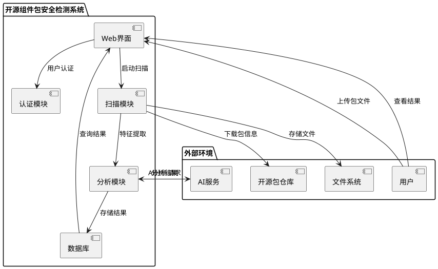
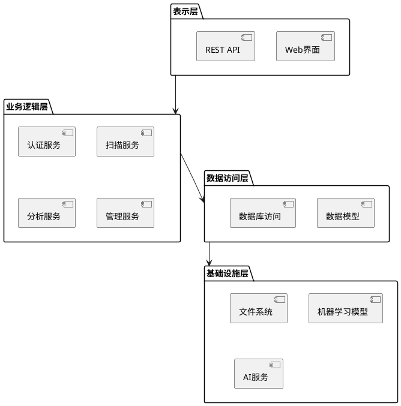
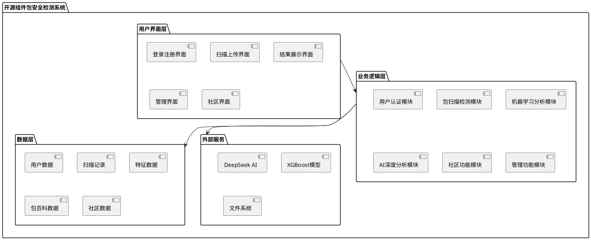
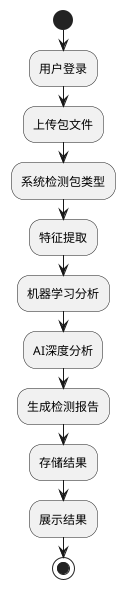

# 开源组件包安全检测系统概要设计说明书

|     |     |     |     |
| --- | --- | --- | --- |
| 拟制  | 系统设计团队 | 日期  | 2024年12月 |
| 评审人 | 技术评审委员会 | 日期  | 2024年12月 |
| 批准  | 项目负责人 | 日期  | 2024年12月 |

**武汉学链科技有限公司**

版权所有 不得复制

## Revision Record 修订记录

| Date<br><br>日期 | Revision Version<br><br>修订版本 | CR ID /Defect ID<br><br>CR/ Defect号 | Sec No.<br><br>修改章节 | Change Description<br><br>修改描述 | Author<br><br>作者 |
| --- | --- | --- | --- | --- | --- |
| 2024-12-01 | 1.0 | - | 全部 | 初始版本创建 | 系统设计团队 |

## Keywords 关键词：

开源组件、安全检测、机器学习、AI分析、恶意代码识别、软件供应链安全

## Abstract 摘 要：

本文档描述了开源组件包安全检测系统的概要设计，该系统采用机器学习与AI技术相结合的方式，对上传的开源组件包进行安全风险检测。系统支持多种包格式，提供详细的风险分析报告，并具备社区功能和管理功能。系统采用Flask框架构建，使用SQLite数据库存储，通过XGBoost模型和DeepSeek AI进行双重分析，确保检测的准确性和可靠性。

## List of abbreviations 缩略语清单：

|     |     |     |
| --- | --- | --- |
| Abbreviations缩略语 | Full spelling 英文全名 | Chinese explanation 中文解释 |
| AI | Artificial Intelligence | 人工智能 |
| API | Application Programming Interface | 应用程序编程接口 |
| CSV | Comma-Separated Values | 逗号分隔值 |
| DB | Database | 数据库 |
| HTTP | HyperText Transfer Protocol | 超文本传输协议 |
| JSON | JavaScript Object Notation | JavaScript对象表示法 |
| LLM | Large Language Model | 大语言模型 |
| ML | Machine Learning | 机器学习 |
| PyPI | Python Package Index | Python包索引 |
| REST | Representational State Transfer | 表述性状态转移 |
| SQL | Structured Query Language | 结构化查询语言 |
| XGBoost | eXtreme Gradient Boosting | 极端梯度提升 |

# 1 简介

## 1.1 目的

本文档的目的是为开源组件包安全检测系统提供详细的概要设计说明，包括系统架构、模块设计、数据库设计、界面设计等。本文档主要面向系统开发人员、测试人员、项目经理以及相关技术评审人员，为系统的开发、测试和维护提供技术指导。

## 1.2 范围

### 1.2.1 软件名称

开源组件包安全检测系统（Open Source Package Security Scanner）

### 1.2.2 软件功能

本系统主要完成以下功能：

**核心功能：**
- 开源组件包安全风险检测
- 多种包格式支持（PyPI、npm、jar等）
- 机器学习模型分析
- AI深度分析
- 详细检测报告生成

**辅助功能：**
- 用户认证与权限管理
- 扫描历史记录管理
- 社区异常报告功能
- 包百科知识库
- 系统管理功能

**不包含功能：**
- 实时网络监控
- 自动修复功能
- 第三方安全工具集成

### 1.2.3 软件应用

本系统主要应用于以下领域：

- **软件开发企业**：在开发过程中检测第三方依赖包的安全性
- **安全研究机构**：进行开源组件安全分析和研究
- **DevOps团队**：在CI/CD流程中集成安全检测
- **个人开发者**：检测项目依赖的安全性

## 1.3 参考资料

1. 《软件包投毒检测系统需求规格说明书》
2. 《软件包投毒检测项目立项报告》
3. Flask官方文档：https://flask.palletsprojects.com/
4. XGBoost官方文档：https://xgboost.readthedocs.io/
5. DeepSeek API文档：https://platform.deepseek.com/

# 2 概要设计

## 2.1 第0层设计描述

### 2.1.1 软件系统上下文定义

系统与外部实体的交互关系如下：



### 2.1.2 设计思路

#### （1）架构设计思路

系统采用分层架构设计，主要分为以下几层：



#### （2）程序框架、目录结构

```
Detect-main/
├── app/                    # 主应用目录
│   ├── __init__.py        # Flask应用工厂
│   ├── models/            # 数据模型
│   ├── routes/            # 路由控制器
│   ├── services/          # 业务逻辑服务
│   ├── templates/         # HTML模板
│   ├── static/            # 静态资源
│   └── utils/             # 工具函数
├── config/                # 配置文件目录
├── models/                # 机器学习模型
├── data/                  # 数据文件目录
├── tests/                 # 测试文件目录
├── scripts/               # 脚本文件目录
├── docs/                  # 文档目录
└── requirements.txt       # Python依赖
```

## 2.2 第1层设计描述

### 2.2.1 系统结构

#### 2.2.1.1 系统结构描述



#### 2.2.1.2 业务流程说明

**主要业务流程：**

