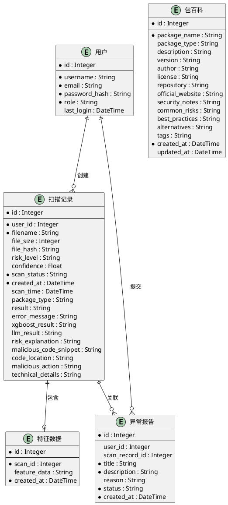
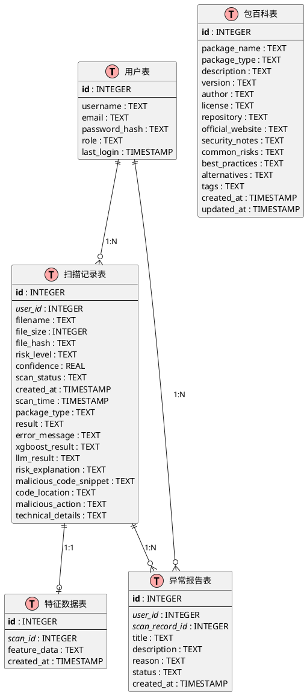
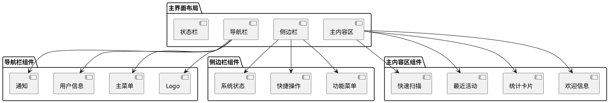
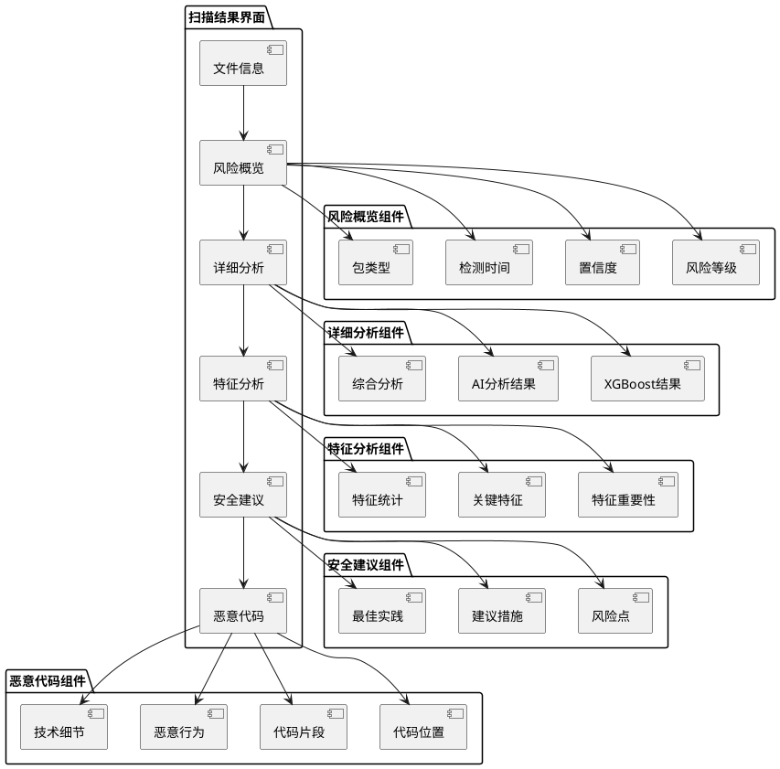

# 3 数据结构/数据库设计

## 3.1 概念模型

## 3.2 数据库表设计

### 3.2.1 用户表（users）

| 字段名 | 数据类型 | 长度 | 是否为空 | 默认值 | 说明 |
|--------|----------|------|----------|--------|------|
| id | INTEGER | - | NOT NULL | AUTOINCREMENT | 主键 |
| username | TEXT | - | NOT NULL | - | 用户名，唯一 |
| email | TEXT | - | - | - | 邮箱，唯一 |
| password_hash | TEXT | - | NOT NULL | - | 密码哈希 |
| role | TEXT | - | NOT NULL | 'user' | 用户角色 |
| last_login | TIMESTAMP | - | - | - | 最后登录时间 |

**索引设计：**
- PRIMARY KEY (id)
- UNIQUE INDEX (username)
- UNIQUE INDEX (email)
- INDEX (role)

### 3.2.2 扫描记录表（scan_records）

| 字段名 | 数据类型 | 长度 | 是否为空 | 默认值 | 说明 |
|--------|----------|------|----------|--------|------|
| id | INTEGER | - | NOT NULL | AUTOINCREMENT | 主键 |
| user_id | INTEGER | - | NOT NULL | - | 用户ID，外键 |
| filename | TEXT | - | NOT NULL | - | 文件名 |
| file_size | INTEGER | - | - | - | 文件大小 |
| file_hash | TEXT | - | - | - | 文件哈希 |
| risk_level | TEXT | - | - | - | 风险等级 |
| confidence | REAL | - | - | - | 置信度 |
| scan_status | TEXT | - | NOT NULL | - | 扫描状态 |
| created_at | TIMESTAMP | - | NOT NULL | CURRENT_TIMESTAMP | 创建时间 |
| scan_time | TIMESTAMP | - | - | - | 扫描时间 |
| package_type | TEXT | - | - | - | 包类型 |
| result | TEXT | - | - | - | 扫描结果 |
| error_message | TEXT | - | - | - | 错误信息 |
| xgboost_result | TEXT | - | - | - | XGBoost结果 |
| llm_result | TEXT | - | - | - | AI分析结果 |
| risk_explanation | TEXT | - | - | - | 风险解释 |
| malicious_code_snippet | TEXT | - | - | - | 恶意代码片段 |
| code_location | TEXT | - | - | - | 代码位置 |
| malicious_action | TEXT | - | - | - | 恶意行为 |
| technical_details | TEXT | - | - | - | 技术细节 |

**索引设计：**
- PRIMARY KEY (id)
- FOREIGN KEY (user_id) REFERENCES users(id)
- INDEX (user_id)
- INDEX (scan_status)
- INDEX (risk_level)
- INDEX (created_at)
- INDEX (file_hash)

### 3.2.3 特征数据表（features）

| 字段名 | 数据类型 | 长度 | 是否为空 | 默认值 | 说明 |
|--------|----------|------|----------|--------|------|
| id | INTEGER | - | NOT NULL | AUTOINCREMENT | 主键 |
| scan_id | INTEGER | - | NOT NULL | - | 扫描ID，外键 |
| feature_data | TEXT | - | - | - | 特征数据JSON |
| created_at | TIMESTAMP | - | NOT NULL | CURRENT_TIMESTAMP | 创建时间 |

**索引设计：**
- PRIMARY KEY (id)
- FOREIGN KEY (scan_id) REFERENCES scan_records(id)
- INDEX (scan_id)

### 3.2.4 包百科表（package_encyclopedia）

| 字段名 | 数据类型 | 长度 | 是否为空 | 默认值 | 说明 |
|--------|----------|------|----------|--------|------|
| id | INTEGER | - | NOT NULL | AUTOINCREMENT | 主键 |
| package_name | TEXT | - | NOT NULL | - | 包名 |
| package_type | TEXT | - | - | - | 包类型 |
| description | TEXT | - | - | - | 描述 |
| version | TEXT | - | - | - | 版本 |
| author | TEXT | - | - | - | 作者 |
| license | TEXT | - | - | - | 许可证 |
| repository | TEXT | - | - | - | 仓库地址 |
| official_website | TEXT | - | - | - | 官方网站 |
| security_notes | TEXT | - | - | - | 安全说明 |
| common_risks | TEXT | - | - | - | 常见风险 |
| best_practices | TEXT | - | - | - | 最佳实践 |
| alternatives | TEXT | - | - | - | 替代方案 |
| tags | TEXT | - | - | - | 标签 |
| created_at | TIMESTAMP | - | NOT NULL | CURRENT_TIMESTAMP | 创建时间 |
| updated_at | TIMESTAMP | - | - | - | 更新时间 |

**索引设计：**
- PRIMARY KEY (id)
- UNIQUE INDEX (package_name, package_type)
- INDEX (package_type)
- INDEX (tags)
- INDEX (created_at)

### 3.2.5 异常报告表（anomaly_reports）

| 字段名 | 数据类型 | 长度 | 是否为空 | 默认值 | 说明 |
|--------|----------|------|----------|--------|------|
| id | INTEGER | - | NOT NULL | AUTOINCREMENT | 主键 |
| user_id | INTEGER | - | - | - | 用户ID，外键 |
| scan_record_id | INTEGER | - | - | - | 扫描记录ID，外键 |
| title | TEXT | - | NOT NULL | - | 报告标题 |
| description | TEXT | - | NOT NULL | - | 报告描述 |
| reason | TEXT | - | - | - | 报告原因 |
| status | TEXT | - | NOT NULL | 'pending' | 状态 |
| created_at | TIMESTAMP | - | NOT NULL | CURRENT_TIMESTAMP | 创建时间 |

**索引设计：**
- PRIMARY KEY (id)
- FOREIGN KEY (user_id) REFERENCES users(id)
- FOREIGN KEY (scan_record_id) REFERENCES scan_records(id)
- INDEX (user_id)
- INDEX (scan_record_id)
- INDEX (status)
- INDEX (created_at)

## 3.3 数据库关系图

# 4 界面设计

## 4.1 主界面设计

**1 界面原图**

主界面采用现代化的深色主题设计，包含导航栏、功能区域和状态显示区域。

**2 界面说明**

- **导航栏**：包含系统Logo、主要功能菜单和用户信息
- **功能区域**：提供扫描上传、历史记录、社区功能等入口
- **状态显示**：显示系统状态和用户登录信息
- **响应式设计**：支持不同屏幕尺寸的适配

### 4.1.1 主界面布局

## 4.2 扫描结果界面

**1 界面原图**

扫描结果界面展示详细的检测报告，包括风险等级、置信度、特征分析等信息。

**2 界面说明**

- **风险概览**：显示整体风险等级和置信度
- **详细分析**：展示XGBoost和AI分析结果
- **特征分析**：显示关键特征和重要性
- **安全建议**：提供针对性的安全建议
- **恶意代码**：展示检测到的可疑代码片段

### 4.2.1 结果界面布局

## 4.3 用户界面设计原则

### 4.3.1 设计原则

1. **简洁性**：界面简洁明了，避免冗余信息
2. **一致性**：保持界面风格和交互方式的一致性
3. **可用性**：确保用户能够轻松完成操作
4. **响应性**：支持不同设备和屏幕尺寸
5. **可访问性**：考虑不同用户的需求和能力

### 4.3.2 色彩方案

- **主色调**：深蓝色系（#1e3a8a, #3b82f6）
- **辅助色**：橙色（#f97316）
- **背景色**：深色主题（#0f172a, #1e293b）
- **文字色**：浅色（#f8fafc, #cbd5e1）
- **状态色**：成功（#10b981）、警告（#f59e0b）、危险（#ef4444）

### 4.3.3 交互设计

- **导航**：清晰的导航结构，支持面包屑导航
- **反馈**：及时的操作反馈和状态提示
- **加载**：优雅的加载动画和进度指示
- **错误处理**：友好的错误提示和恢复建议

## 4.4 响应式设计

### 4.4.1 断点设计

- **移动端**：< 768px
- **平板端**：768px - 1024px
- **桌面端**：> 1024px

### 4.4.2 适配策略

- **弹性布局**：使用Flexbox和Grid布局
- **媒体查询**：针对不同屏幕尺寸优化
- **图片优化**：响应式图片和图标
- **触摸优化**：移动端触摸友好的交互

# 5 出错处理设计

## 5.1 异常处理策略

### 5.1.1 文件上传异常

- **文件格式不支持**：返回友好的错误提示，说明支持的格式
- **文件大小超限**：提示文件大小限制，建议压缩或分批上传
- **文件损坏**：检测文件完整性，提示重新上传

### 5.1.2 扫描过程异常

- **特征提取失败**：记录错误日志，返回降级分析结果
- **模型加载失败**：使用备用模型或规则引擎
- **AI服务异常**：降级到纯机器学习分析

### 5.1.3 数据库异常

- **连接失败**：实现连接池和重试机制
- **数据损坏**：提供数据修复工具
- **并发冲突**：使用事务和锁机制

## 5.2 错误日志设计

### 5.2.1 日志级别

- **DEBUG**：详细的调试信息
- **INFO**：一般信息记录
- **WARNING**：警告信息
- **ERROR**：错误信息
- **CRITICAL**：严重错误

### 5.2.2 日志内容

- 时间戳
- 日志级别
- 模块名称
- 错误描述
- 堆栈跟踪
- 用户信息
- 请求参数

## 5.3 用户友好的错误提示

### 5.3.1 错误消息设计

- 使用简洁明了的语言
- 提供具体的解决建议
- 避免技术术语
- 支持多语言

### 5.3.2 错误恢复机制

- 自动重试机制
- 手动重试选项
- 联系支持渠道
- 问题反馈功能

## 5.4 系统监控和告警

### 5.4.1 监控指标

- **性能指标**：响应时间、吞吐量、资源使用率
- **错误指标**：错误率、异常数量、失败率
- **业务指标**：扫描成功率、用户活跃度、系统可用性

### 5.4.2 告警机制

- **实时告警**：关键错误和异常
- **阈值告警**：性能指标超过阈值
- **趋势告警**：异常趋势和模式识别

---

**文档结束** 