# 2.2.2 分解描述

## 2.2.2.1 用户认证模块

**1、简介**

用户认证模块负责系统的用户管理、登录认证、权限控制等功能，确保系统安全性和用户数据的隔离。

**2、功能列表**

- 用户注册
- 用户登录
- 密码加密
- 会话管理
- 权限验证

### 2.2.2.1.1 用户注册功能

**1 功能设计描述**

**（1）类**

**1）User类**

负责用户数据的封装和基本操作。

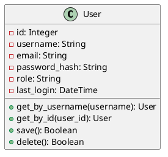

**2）AuthService类**

负责用户认证相关的业务逻辑。

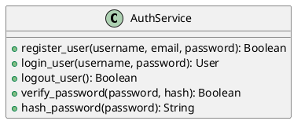

**（2）类与类之间关系**

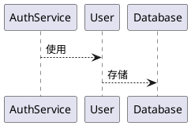

**（3）文件列表**

|     |     |     |     |
| --- | --- | --- | --- |
| 名称  | 类型  | 存放位置 | 说明  |
| auth.py | Python | app/routes/auth.py | 认证路由控制器 |
| db_models.py | Python | app/models/db_models.py | 用户数据模型 |
| login.html | HTML | app/templates/login.html | 登录页面 |
| register.html | HTML | app/templates/register.html | 注册页面 |

**2 功能实现说明**

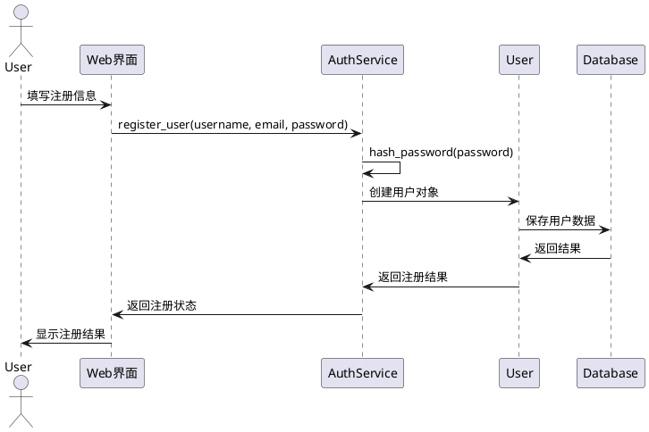

## 2.2.2.2 包扫描检测模块

**1、简介**

包扫描检测模块是系统的核心功能模块，负责接收用户上传的包文件，进行特征提取、安全分析，并生成检测报告。

**2、功能列表**

- 文件上传处理
- 包类型检测
- 特征提取
- 扫描状态管理
- 结果存储

### 2.2.2.2.1 文件上传功能

**1 功能设计描述**

**（1）类**

**1）ScanRecord类**

负责扫描记录的数据封装。

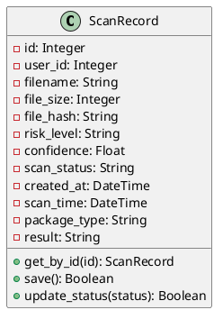

**2）ScanService类**

负责扫描相关的业务逻辑。

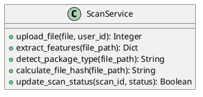

**（2）类与类之间关系**

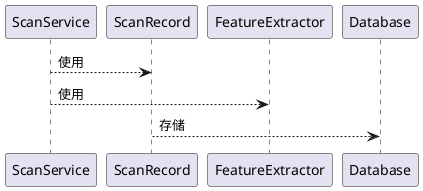

**（3）文件列表**

|     |     |     |     |
| --- | --- | --- | --- |
| 名称  | 类型  | 存放位置 | 说明  |
| scan.py | Python | app/routes/scan.py | 扫描路由控制器 |
| extractor.py | Python | app/services/extractor.py | 特征提取服务 |
| scan.html | HTML | app/templates/scan.html | 扫描上传页面 |
| progress.html | HTML | app/templates/progress.html | 扫描进度页面 |

**2 功能实现说明**

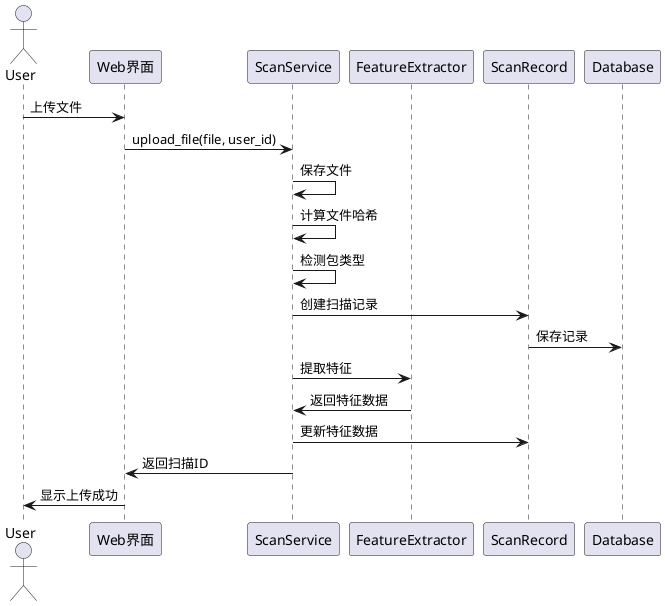

## 2.2.2.3 机器学习分析模块

**1、简介**

机器学习分析模块使用XGBoost等机器学习算法对提取的特征进行分析，识别潜在的恶意行为。

**2、功能列表**

- 模型加载
- 特征预处理
- 风险预测
- 置信度计算
- 特征重要性分析

### 2.2.2.3.1 风险预测功能

**1 功能设计描述**

**（1）类**

**1）SecurityClassifier类**

负责机器学习模型的加载和预测。

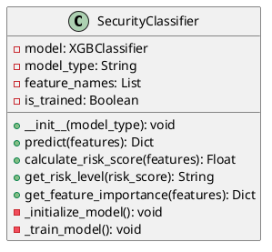

**2）FeatureProcessor类**

负责特征数据的预处理。

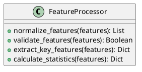

**（2）类与类之间关系**

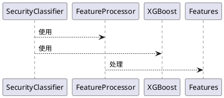

**（3）文件列表**

|     |     |     |     |
| --- | --- | --- | --- |
| 名称  | 类型  | 存放位置 | 说明  |
| classifier.py | Python | app/services/classifier.py | 机器学习分类器 |
| xgboost_model.pkl | Model | models/xgboost_model.pkl | XGBoost模型文件 |
| feature_names.txt | Text | data/feature_names.txt | 特征名称列表 |

**2 功能实现说明**

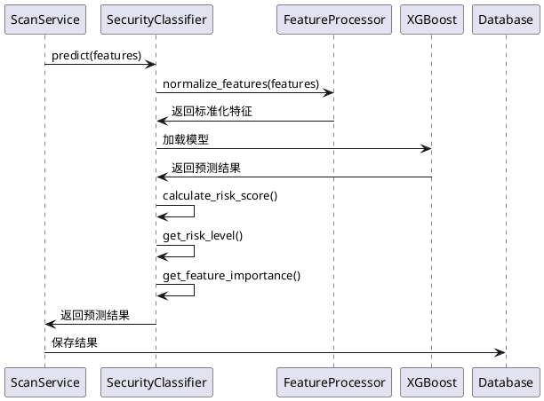

## 2.2.2.4 AI深度分析模块

**1、简介**

AI深度分析模块使用DeepSeek等大语言模型对包进行深度分析，提供更详细的安全风险评估和解释。

**2、功能列表**

- AI模型调用
- 分析提示构建
- 结果解析
- 风险解释
- 建议生成

### 2.2.2.4.1 AI分析功能

**1 功能设计描述**

**（1）类**

**1）DeepSeekAnalyzer类**

负责AI深度分析的核心功能。

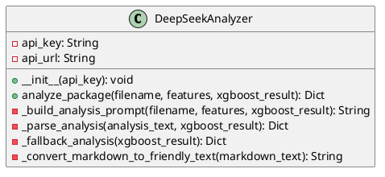

**2）AnalysisResult类**

负责分析结果的数据封装。

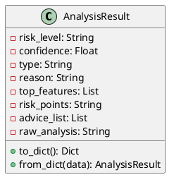

**（2）类与类之间关系**

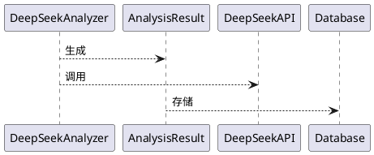

**（3）文件列表**

|     |     |     |     |
| --- | --- | --- | --- |
| 名称  | 类型  | 存放位置 | 说明  |
| analyzer.py | Python | app/services/analyzer.py | AI分析服务 |
| config.py | Python | config/config.py | API配置 |
| analysis_prompts.py | Python | app/utils/analysis_prompts.py | 分析提示模板 |

**2 功能实现说明**

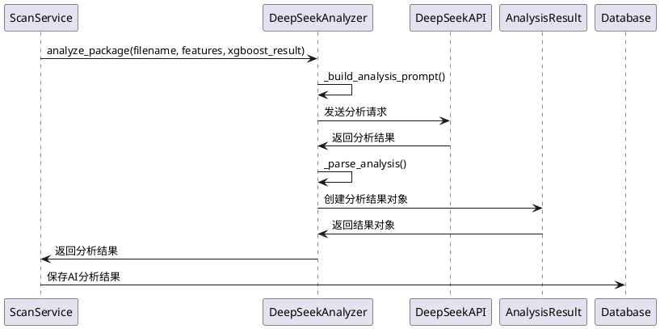

## 2.2.2.5 社区功能模块

**1、简介**

社区功能模块提供用户交流、异常报告、知识分享等功能，增强系统的社区属性。

**2、功能列表**

- 异常报告
- 社区讨论
- 知识分享
- 用户互动

### 2.2.2.5.1 异常报告功能

**1 功能设计描述**

**（1）类**

**1）AnomalyReport类**

负责异常报告的数据管理。

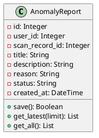

**2）CommunityService类**

负责社区功能的业务逻辑。

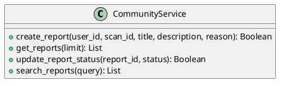

**（2）类与类之间关系**

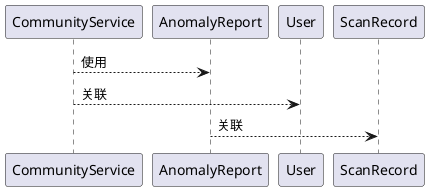

**（3）文件列表**

|     |     |     |     |
| --- | --- | --- | --- |
| 名称  | 类型  | 存放位置 | 说明  |
| community.py | Python | app/routes/community.py | 社区路由控制器 |
| community_models.py | Python | app/models/community_models.py | 社区数据模型 |
| community.html | HTML | app/templates/community/index.html | 社区主页 |
| report_anomaly.html | HTML | app/templates/community/report_anomaly.html | 异常报告页面 |

## 2.2.2.6 管理功能模块

**1、简介**

管理功能模块为管理员提供系统管理、用户管理、数据统计等功能。

**2、功能列表**

- 用户管理
- 系统配置
- 数据统计
- 模型管理

### 2.2.2.6.1 用户管理功能

**1 功能设计描述**

**（1）类**

**1）AdminService类**

负责管理员功能的业务逻辑。

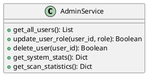

**2）UserManagement类**

负责用户管理的具体操作。

```plantuml
@startuml
class UserManagement {
    +list_users(): List
    +edit_user(user_id, data): Boolean
    +delete_user(user_id): Boolean
    +reset_user_password(user_id): Boolean
}
@enduml
```

**（2）类与类之间关系**

```plantuml
@startuml
AdminService --> UserManagement : 使用
AdminService --> User : 管理
UserManagement --> Database : 操作
@enduml
```

**（3）文件列表**

|     |     |     |     |
| --- | --- | --- | --- |
| 名称  | 类型  | 存放位置 | 说明  |
| admin.py | Python | app/routes/admin.py | 管理路由控制器 |
| admin.html | HTML | app/templates/admin.html | 管理主页 |
| user_management.html | HTML | app/templates/user_management.html | 用户管理页面 |

## 2.2.3 接口描述

### 2.2.3.1 文件上传接口

**Name名称：** upload_file

**Description说明：** 处理用户上传的包文件，启动扫描流程

**Definition定义：**
```python
POST /upload
Content-Type: multipart/form-data

Parameters:
- file: File (required) - 上传的包文件
- user_id: Integer (required) - 用户ID

Response:
{
    "success": Boolean,
    "scan_id": Integer,
    "message": String
}
```

### 2.2.3.2 扫描状态查询接口

**Name名称：** get_scan_status

**Description说明：** 查询扫描任务的当前状态和进度

**Definition定义：**
```python
GET /scan_status/<scan_id>

Parameters:
- scan_id: Integer (required) - 扫描ID

Response:
{
    "status": String,  // pending, processing, completed, failed
    "progress": Integer,  // 0-100
    "current_task": String
}
```

### 2.2.3.3 结果获取接口

**Name名称：** get_scan_results

**Description说明：** 获取扫描的详细结果和分析报告

**Definition定义：**
```python
GET /results/<scan_id>

Parameters:
- scan_id: Integer (required) - 扫描ID

Response:
{
    "id": Integer,
    "filename": String,
    "risk_level": String,
    "confidence": Float,
    "xgboost_result": Object,
    "llm_result": Object,
    "features": Object,
    "malicious_code_snippet": String,
    "code_location": String,
    "malicious_action": String,
    "technical_details": String
}
``` 